# The R Project for Statistical Computing

[Tutorial link][2]

## Getting Started

R is a free software environment for statistical computing and graphics. It compiles and runs on a wide variety of UNIX platforms, Windows and MacOS. To `download R`, please choose your preferred [CRAN][1] mirror.

If you have questions about R like how to download and install the software, or what the license terms are, please read our answers to frequently asked questions before you send an email.

### First R Program

```r
print('Hello R Program')
```

```r
> print('Hello R Program')
[1] "Hello R Program"
```

```sh
$ Rscript test.R
[1] "hello world"
$ R CMD BATCH test.R
$ ls
test.R  test.Rout
```

### Basic Mathematical Operators

```r
x <- 10 # assign 10 into variable x
y <- 20 # assign 20 into variable y

z <- x +  y # add x and y and assign result in variable z
print(z) # show the value of variable z
```

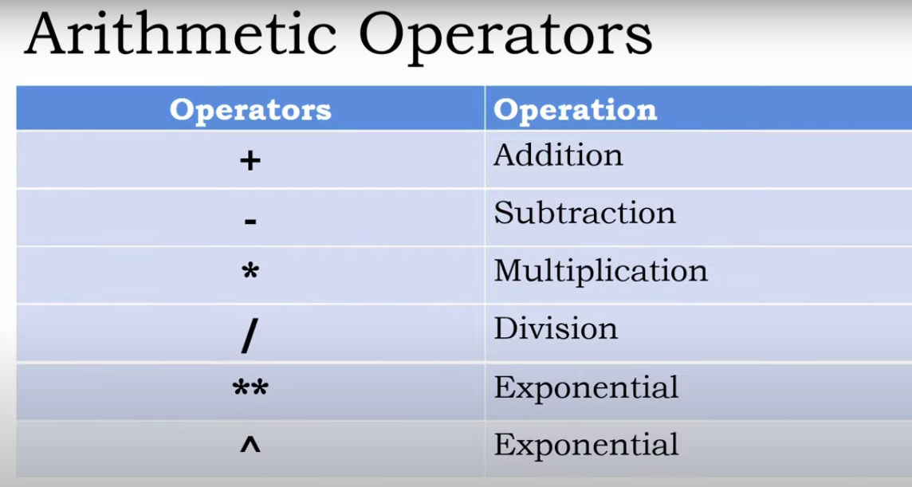

```r
> 10 - 5
[1] 5

> 10 * 5
[1] 50

> 10 / 3
[1] 3.333333

> 10.4 / 3
[1] 3.466667

> 10 / 2
[1] 5

> 10.0 / 2
[1] 5

> 10 ** 3
[1] 1000

> 10 ^ 3
[1] 1000

> 9 ** .5
[1] 3

> 9 ** 1 / 2   # Because ** > / (precidence)
[1] 4.5

> 9 ** (1 / 2)
3
```

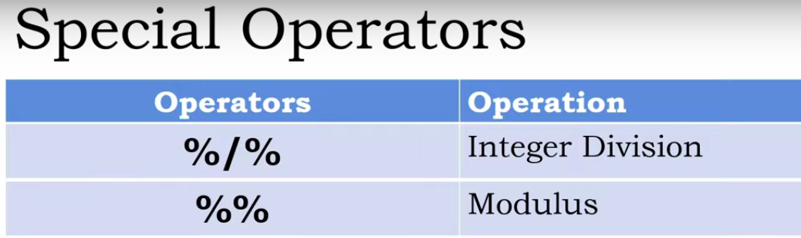

```r
> 14 %% 3
[1] 2

> 14.5 %% 3
[1] 2.5

> 14 %% 3.4
[1] 0.4
```

### Integer Division

Integer division always return the floor value

```r
> 8 / 3
[1] 2.666667

> 8 %/% 3
[1] 2

> - 8 / 3
[1] -2.666667

> -8 %/% 3
[1] -3
```

#### Note: we cannot add `string and integer` numbers and also `string and string`

### Variables

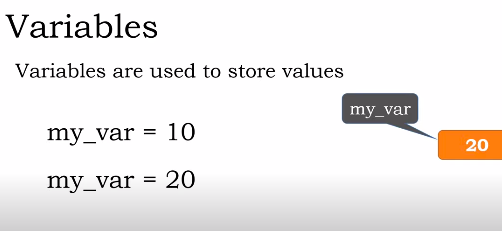

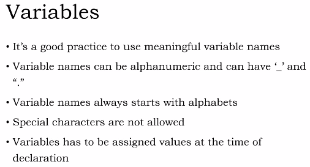

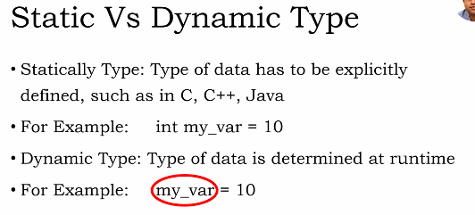

### R is Dynamically Type Language

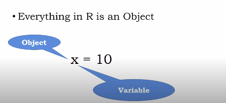

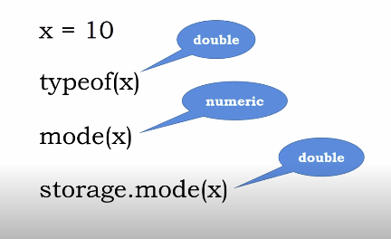

#### Declare Variable

```r
age <- 10
marks1 <- 20
subject_name <- 'R'

# cannot use
# $subject_name <- 'Java'
# 3name <- 'Alex'
```

#### Variable Properties

```sh
age <- 10
typeof(age) # double
mode(age) # numeric
storage.mode(age) # double
class(age) # numeric

subject_name = 'R'
typeof(subject_name) # character
mode(subject_name) # character
storage.mode(subject_name) # character
class(subject_name) # character

> marks1 <- 20.10
> typeof(marks1)
[1] "double"
> mode(marks1)
[1] "numeric"
> storage.mode(marks1)
[1] "double"
> class(marks1)
[1] "numeric"

> flag = TRUE
> typeof(flag)
[1] "logical"
> mode(flag)
[1] "logical"
> storage.mode(flag)
[1] "logical"
> class(flag)
[1] "logical"
```

### Variable Expression

```r
x <- 10
y <- 20
sum = x + y # expression
```

### List of Keywords

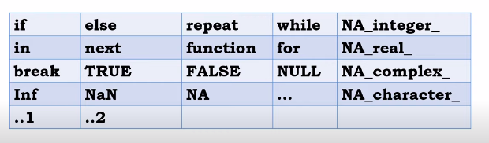

We cannot able to use keyword as variable name.

### Basic Data Types

```r
x <- 10.23
x
# To know variable data types 
class(x) #numeric 
```

```r
> x <- 10
> x
[1] 10
> # To know variable data types 
> class(x)
[1] "numeric"
```

```r
> is.integer(x)
FALSE
```

Now to create a integer variable in R programming language

```r
 y <- as.integer(10) 
> class(y)
[1] "integer"
> is.integer(y)
[1] TRUE
> y <- as.integer(10)
> print(y)
[1] 10
> class(y)
[1] "integer"
> is.integer(y)
[1] TRUE

> y <- as.integer(10.35)
> print(y)
[1] 10 # truncated floating point portion
> class(y)
[1] "integer"
> is.integer(y)
[1] TRUE

# Create integer variable using `L`
y <- 105L
print(y) # 105
class(y) # integer
is.integer(y) # true

# We can also pass string as input -> numeric
y <- as.integer('10.35') # it works because `10.35` is numeric value
print(y)
class(y)
is.integer(y)

> # But if we pass string -> ex. name as input
> y <- as.integer('Jhon')
Warning message:
NAs introduced by coercion
> print(y)
[1] NA
> class(y)
[1] "integer"
> is.integer(y)
[1] TRUE
```

**Other Types**:

```r
x <- 4 + 3i # complex
x <- T      # logical T: TRUE
x <- F      # logical F: FALSE
x <- "Jack" # character
x <- as.character(3.75) # convert numerical to character
is.character(x) # TRUE
```

### Variable Assignment

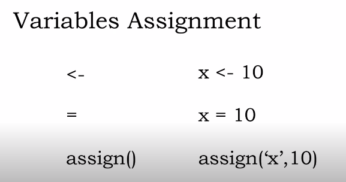

```r
x <- 10 # assign x to 10
y = 30 # assign y to 30
assign('z', 50) # assign z to 50

70 -> w # assign 70 in variable w

# multiple assignment at same time
a <- b <- c <- d <- 15
```

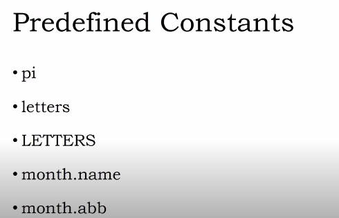

```sh
> pi_value = pi
> pi_value
[1] 3.141593
> small_letters = letters
> small_letters
 [1] "a" "b" "c" "d" "e" "f" "g" "h" "i" "j" "k" "l" "m" "n" "o" "p" "q" "r" "s"
[20] "t" "u" "v" "w" "x" "y" "z"
> capital_letters = LETTERS
> capital_letters
 [1] "A" "B" "C" "D" "E" "F" "G" "H" "I" "J" "K" "L" "M" "N" "O" "P" "Q" "R" "S"
[20] "T" "U" "V" "W" "X" "Y" "Z"
> month_name = month.name
> month_name
 [1] "January"   "February"  "March"     "April"     "May"       "June"     
 [7] "July"      "August"    "September" "October"   "November"  "December" 
> month_name_abbr = month.abb
> month_name_abbr
 [1] "Jan" "Feb" "Mar" "Apr" "May" "Jun" "Jul" "Aug" "Sep" "Oct" "Nov" "Dec"
```

### Comments in R Language

`# character is used as a comment in R language`

### Relational Operator

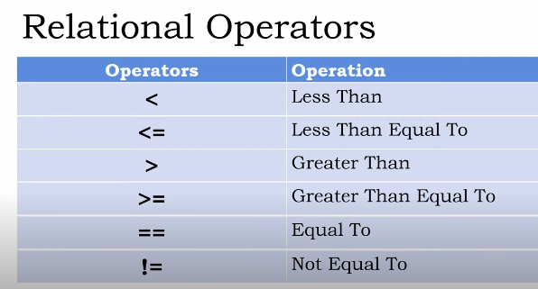

```sh
> 'nahid' != 'hassan'
[1] TRUE
> !'nahid'
Error in !"nahid" : invalid argument type
```

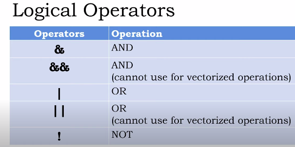

### Sequence

```sh
> x = 1: 10
> x
 [1]  1  2  3  4  5  6  7  8  9 10
> y = 10: 1
> y
 [1] 10  9  8  7  6  5  4  3  2  1
> x = 1 : 10 * 10 # first create the sequence then multiply with 10
> x
 [1]  10  20  30  40  50  60  70  80  90 100
> x = 1: 10 - 1 # first create the sequence then subtract by 1
> x
 [1] 0 1 2 3 4 5 6 7 8 9
> x = 5 # assign x to 5
> 1: x # show 1 to 5 in the console
[1] 1 2 3 4 5
> 1 : x - 1
[1] 0 1 2 3 4
> 1 : (x - 1)
[1] 1 2 3 4
> # create a sequence using seq(start_point, end_point)
> x <- seq(1, 5)
> x
[1] 1 2 3 4 5
> x = seq(10) # by default begin from 1
> x # 1.........10
 [1]  1  2  3  4  5  6  7  8  9 10
> x = seq(from=5, to=2)
> print(x)
[1] 5 4 3 2
> x = seq(from=1, to =5)
> print(x)
[1] 1 2 3 4 5
> x = seq(from=5, to=50, by=5)
> print(x)
 [1]  5 10 15 20 25 30 35 40 45 50
> # or
> x = seq(5, 50, 5)
> print(x)
 [1]  5 10 15 20 25 30 35 40 45 50
> # length argument
> x = seq(5, 100, length=10)
> x
 [1]   5.00000  15.55556  26.11111  36.66667  47.22222  57.77778  68.33333
 [8]  78.88889  89.44444 100.00000
> x = seq(1.0, 2.0, 0.1)
> x
 [1] 1.0 1.1 1.2 1.3 1.4 1.5 1.6 1.7 1.8 1.9 2.0
> # by or third argument cannot be zero.
> # !!!ERROR!!!
> # x = seq(1, 5, 0) # occur an error
```

### Replicate Function

```sh
> # number replicate
> x <- rep(1, times=4) # 1 1 1 1
> x
[1] 1 1 1 1
> # character replicate
> c <- rep('z', times=5)
> c
[1] "z" "z" "z" "z" "z"
> # sequence replicate
> x = 1 : 3
> y = rep(x, times=3)
> y
[1] 1 2 3 1 2 3 1 2 3
> # each arguments
> x = 1 : 3
> y = rep(x, each=3) # each element assign 3 times
> y
[1] 1 1 1 2 2 2 3 3 3
```

### Control Structures

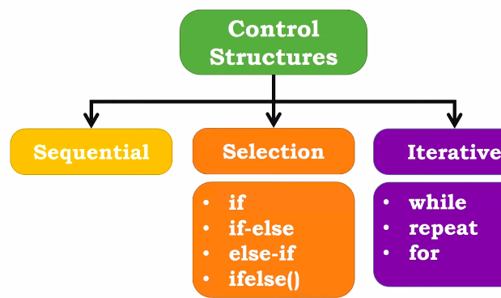

### if-else 

<!-- url/paths -->
[1]: https://cran.r-project.org/mirrors.html
[2]: https://youtu.be/NVyOEwOJgNQ
