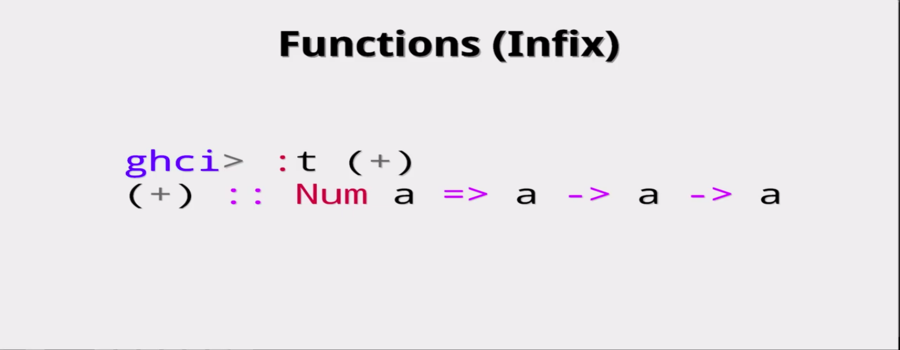

# HASKELL

- List Of Contents
  - [Prerequisites](#PREREQUISITES)
  - [Functions, Type, let, & where](#functions-types-let--where)

## PREREQUISITES

**Functional Programming**:

**Declarative vs Imperative**:

**Lazy Evaluation vs Strict Evaluation**:

Lazy Evaluation means, it evaluate when it needs.
Like here first evaluate `z` because z occur first then evaluate `x` and then `y`.

## Functions, Types, let, & where

`function_name` `arguments_without_comma_separate` = `condition/statements/expressions`

