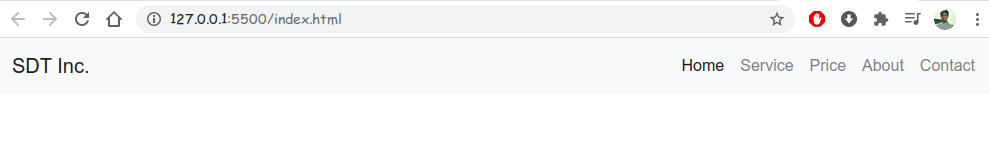

# Complete Responsive Website using HTML CSS Bootstrap 4 and JavaScript

```console
root@admin: ~$ tree
.
├── css
│   └── style.css
├── images
├── index.html
└── README.md
```

_index.html_:

Open Bootstrap4: <https://getbootstrap.com/docs/4.0/getting-started/introduction/#starter-template> starter template and copy the code and paste it into the `index.html`.

After doing that,

```html
<!doctype html>
<html lang="en">

<head>
    <!-- Required meta tags -->
    <meta charset="utf-8">
    <meta name="viewport" content="width=device-width, initial-scale=1, shrink-to-fit=no">

    <!-- Bootstrap CSS -->
    <link rel="stylesheet" href="https://maxcdn.bootstrapcdn.com/bootstrap/4.0.0/css/bootstrap.min.css"
        integrity="sha384-Gn5384xqQ1aoWXA+058RXPxPg6fy4IWvTNh0E263XmFcJlSAwiGgFAW/dAiS6JXm" crossorigin="anonymous">

    <title>Complete Responsive Website using HTML CSS Bootstrap 4 and JavaScript</title>
</head>

<body>

    <!-- Optional JavaScript -->
    <!-- jQuery first, then Popper.js, then Bootstrap JS -->
    <script src="https://code.jquery.com/jquery-3.2.1.slim.min.js"
        integrity="sha384-KJ3o2DKtIkvYIK3UENzmM7KCkRr/rE9/Qpg6aAZGJwFDMVNA/GpGFF93hXpG5KkN"
        crossorigin="anonymous"></script>
    <script src="https://cdnjs.cloudflare.com/ajax/libs/popper.js/1.12.9/umd/popper.min.js"
        integrity="sha384-ApNbgh9B+Y1QKtv3Rn7W3mgPxhU9K/ScQsAP7hUibX39j7fakFPskvXusvfa0b4Q"
        crossorigin="anonymous"></script>
    <script src="https://maxcdn.bootstrapcdn.com/bootstrap/4.0.0/js/bootstrap.min.js"
        integrity="sha384-JZR6Spejh4U02d8jOt6vLEHfe/JQGiRRSQQxSfFWpi1MquVdAyjUar5+76PVCmYl"
        crossorigin="anonymous"></script>
</body>

</html>
```

We put `javascript` and `jquery` just above the `</body>` end body tag for fastest loading in our webpage.

First we create a `div` tag with `header` class and `topheader` id.

```html
<div class="header" id="topheader">
        
</div>
```

Next we need a `Navbar`. To do we just go to the `Bootstrap Components` and find the navbar and copy the code and put inside the above `div` tag in the `index.html`

Here is our navbar code that I copied from Bootstrap -> components -> navbar

```html
<nav class="navbar navbar-expand-lg navbar-light bg-light">
  <a class="navbar-brand" href="#">Navbar</a>
  <button class="navbar-toggler" type="button" data-toggle="collapse" data-target="#navbarSupportedContent" aria-controls="navbarSupportedContent" aria-expanded="false" aria-label="Toggle navigation">
    <span class="navbar-toggler-icon"></span>
  </button>

  <div class="collapse navbar-collapse" id="navbarSupportedContent">
    <ul class="navbar-nav mr-auto">
      <li class="nav-item active">
        <a class="nav-link" href="#">Home <span class="sr-only">(current)</span></a>
      </li>
      <li class="nav-item">
        <a class="nav-link" href="#">Link</a>
      </li>
      <li class="nav-item dropdown">
        <a class="nav-link dropdown-toggle" href="#" id="navbarDropdown" role="button" data-toggle="dropdown" aria-haspopup="true" aria-expanded="false">
          Dropdown
        </a>
        <div class="dropdown-menu" aria-labelledby="navbarDropdown">
          <a class="dropdown-item" href="#">Action</a>
          <a class="dropdown-item" href="#">Another action</a>
          <div class="dropdown-divider"></div>
          <a class="dropdown-item" href="#">Something else here</a>
        </div>
      </li>
      <li class="nav-item">
        <a class="nav-link disabled" href="#">Disabled</a>
      </li>
    </ul>
    <form class="form-inline my-2 my-lg-0">
      <input class="form-control mr-sm-2" type="search" placeholder="Search" aria-label="Search">
      <button class="btn btn-outline-success my-2 my-sm-0" type="submit">Search</button>
    </form>
  </div>
</nav>
```

Then remove the `dropdown` and `search box` and `disable` from the above code. After do that we add 3 more nav-item like `Home` list then our source code look like that...

```html
<div class="header" id="topheader">
        <nav class="navbar navbar-expand-lg navbar-light bg-light">
            <a class="navbar-brand" href="#">SDT Inc.</a>
            <button class="navbar-toggler" type="button" data-toggle="collapse" data-target="#navbarSupportedContent"
                aria-controls="navbarSupportedContent" aria-expanded="false" aria-label="Toggle navigation">
                <span class="navbar-toggler-icon"></span>
            </button>

            <div class="collapse navbar-collapse" id="navbarSupportedContent">
                <ul class="navbar-nav mr-auto">
                    <li class="nav-item active">
                        <a class="nav-link" href="#">Home <span class="sr-only">(current)</span></a>
                    </li>
                    <li class="nav-item">
                        <a class="nav-link" href="#">Service</a>
                    </li>
                    <li class="nav-item">
                        <a class="nav-link" href="#">Price</a>
                    </li>
                    <li class="nav-item">
                        <a class="nav-link" href="#">About</a>
                    </li>
                    <li class="nav-item">
                        <a class="nav-link" href="#">Contact</a>
                    </li>
            </div>
        </nav>
    </div>
```

Now we want to move `Home, Service, Price, About an Contact` into the `left` side of the `Navbar`. To doing these we just need to change into the `mr-auto` to `ml-auto`.

`mr-auto`: margin-right auto

`ml-auto`: margin-left auto

```html
<div class="collapse navbar-collapse" id="navbarSupportedContent">
    <ul class="navbar-nav mr-auto">
    ....Home, Service, Price, About an Contact....
    </ul>
</div>
```

Our current webpage navbar,



Now we want to add space both side of the navbar. To do this...we add a `div` tag with Bootstrap `container` class just below the `nav` tag. Also we add `text-uppercase` property for nav items and aslo set pd-2.

`text-uppercase`: text-uppercase convert nav items name into uppercase.
`pd-2`: add padding-2 in the navbar.

```html
<nav class="navbar navbar-expand-lg navbar-light bg-light">
    <div class="container text-uppercase pd-2">
        ....navbar item....
    </div>
</nav>
```

Now see the effect...


Now we want to content below the navbar... like this


For doing that below the `</nav>` tag we add/create a `<section>...</section>`

```html
<section class="header-section">
    <div class="center-div">
        <h1 class="font-weight-bold">We are The Web Developers</h1>
        <p>We create the world best websites.</p>
        <div class="header-buttons">
            <a href="#">About Us</a>
            <a href="#">Contact</a>
        </div>
    </div>
</section>
```

See the effect,


Now we apply `CSS` in our `header-section`, to do that first create a `link` between `index.html` and `style.css`

```html
<link rel="stylesheet" href="style.css">
```

Then edit our `style.css` file.

`100vh`: height: 100vh; means the height of this element is equal to 100% of the viewport height. example: height: 50vh; If your screen height is 1000px, your element height will be equal to 500px (50% of 1000px). height: calc(100%-100px); will calculate the size of the element by using the value of the element.
