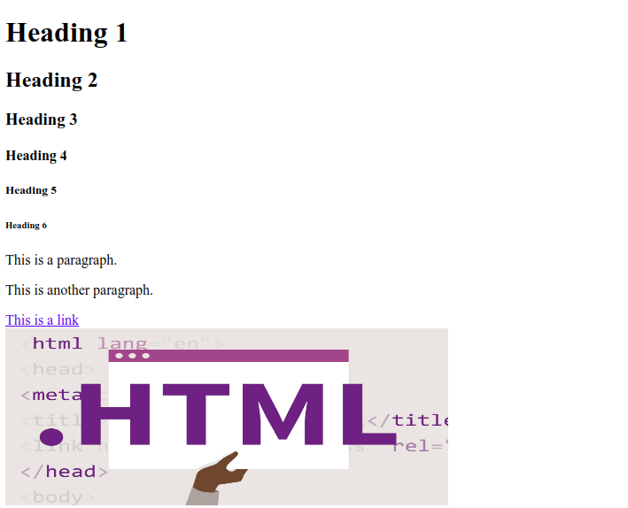

# HTML Tag Example

## Different Html Tag And It'S Output

- [HTML Tag Example](#html-tag-example)
  - [Different Html Tag And It'S Output](#different-html-tag-and-its-output)
    - [1. `<marquee> ... </marquee>` Tag](#1-marquee--marquee-tag)
    - [1. Introduction](#1-introduction)
    - [Basics](#basics)

### 1. `<marquee> ... </marquee>` Tag

**Example~1 - `marquee` tag**:

```html
<body>
    <marquee direction="left" scrollamount="5" onmouseover="this.stop()" onmouseout="this.start()">
        নো মাস্ক নো সার্ভিস। করোনাভাইরাসের বিস্তার রোধে এখনই ডাউনলোড করুন Corona Tracer BD অ্যাপ। ডাউনলোড করতে ক্লিক করুন <a
        href="https://bit.ly/coronatracerbd" target="_blank" style="color: blue;">https://bit.ly/coronatracerbd</a>।
    </marquee>
</body>
```

**Output**:


**Example~2 - `marquee` tag**:

```html
<marquee behavior="scroll" direction="up">
        
    </marquee>
```

**Output**:


To learn more about marquee please visit:

1. [Marquee Behavior to move text in different styles][1]
2. [The Marquee element (Obsolete)][2]

### 1. Introduction

```html
<!DOCTYPE html>
<html>
    <head>
        <title>Page Title</title>
    </head>
    <body>
        <h1>My First Heading</h1>
        <p>My First Paragraph</p>
    </body>
</html>
```

**Preview**:


### Basics

```html
<!DOCTYPE html>
<html>
    <head>
        <title>This is the page title</title>
    </head>
    <body>
        <!-- heading tag -->
        <h1>Heading 1</h1>
        <h2>Heading 2</h2>
        <h3>Heading 3</h3>
        <h4>Heading 4</h4>
        <h5>Heading 5</h5>
        <h6>Heading 6</h6>

        <!-- paragraph tag -->
        <p>This is a paragraph.</p>
        <p>This is another paragraph.</p>

        <!-- html links -->
        <a href="https://www.w3schools.com">This is a link</a>

        <!-- bracket tag -->
        <br>

        <!-- image tag -->
        
    </body>
</html>
```

**Preview**:



<!-- urls/paths -->
[1]: https://www.plus2net.com/html_tutorial/html_marquee_behvr.php
[2]: https://developer.mozilla.org/en-US/docs/Web/HTML/Element/marquee
