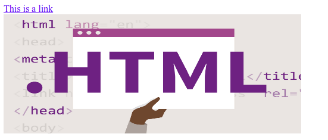

# HTML Basic Examples

In this chapter we will show some basic HTML examples.

### HTML Documents

- All HTML documents must start with a document type declaration: `<!DOCTYPE html>`.
- The HTML document itself begins with `<html>` and ends with `</html>`.
- The visible part of the HTML document is between `<body>` and `</body>`.

### The `<!DOCTYPE>` Declaration

- The `<!DOCTYPE>` declaration represents the document type, and helps browsers to display web pages correctly.
- It must only appear once, at the `top of the page` (`before any HTML tags`).
- The `<!DOCTYPE>` declaration is `not case sensitive`.
- The `<!DOCTYPE>` declaration for HTML5 is:

```html
<!DOCTYPE html>
```

### HTML Headings

HTML headings are defined with the `<h1>` to `<h6>` tags.

`<h1>` defines the `most important heading`. `<h6>` defines the `least important heading`.

```html
<body>
    <!-- heading tag -->
    <h1>Heading 1</h1>
    <h2>Heading 2</h2>
    <h3>Heading 3</h3>
    <h4>Heading 4</h4>
    <h5>Heading 5</h5>
    <h6>Heading 6</h6>
</body>
```

**Preview**:


### HTML Paragraphs

HTML `paragraphs` are defined with the `<p>` tag

```html
<p>This is a paragraph.</p>
<p>This is another paragraph.</p>
```

**Preview**:


### HTML Links and Image

- HTML links are defined with the `<a>` tag:
- HTML images are defined with the `` tag. The source file (src), alternative text (alt), width, and height are provided as attributes:

```html
<a href="https://www.w3schools.com">This is a link</a>


```

**Preview**:




The link's destination is specified in the href attribute.
Attributes are used to provide additional information about HTML elements.
