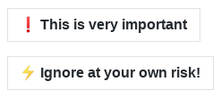
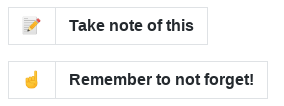
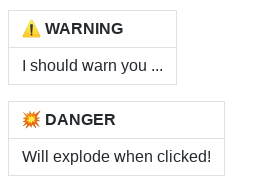

# Style

Github strips script and style tags from the markdown before displaying it. This means the only possibilities for notification boxes that will render on Github are those provided by native markdown or html.

After some searching and experimenting, I discovered it is possible to (ab)use the tables syntax,
and combine it with Github emoji markdown.

For example:

Boxes from a single cell table:

```text
| :exclamation:  This is very important |
| ------------------------------------- |

| :zap:        Ignore at your own risk! |
| ------------------------------------- |
```



Boxes from a single row table with 2 cells:


```text
| :memo: | Take note of this |
| ------ | :---------------- |

| :point_up: | Remember to not forget! |
| ---------- | :---------------------- |
```



Boxes from a 2 row table:

```text
| :warning: WARNING     |
| :-------------------- |
| I should warn you ... |

| :boom: DANGER              |
| :------------------------- |
| Will explode when clicked! |
```

