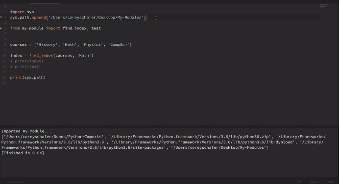

# Youtube Tutorial Link

next: <https://www.youtube.com/watch?v=CqvZ3vGoGs0&list=PL-osiE80TeTt2d9bfVyTiXJA-UTHn6WwU&index=9&ab_channel=CoreySchafer>

advanced_python: <https://www.youtube.com/watch?v=mclfteWlT2Q&list=PLzMcBGfZo4-kwmIcMDdXSuy_wSqtU-xDP&ab_channel=TechWithTim>

## Export `PYTHONPATH` variable rather than to append path in sys.path.append()



## Python Package Management System

```sh
# you can use both pip and pip3. Currently in my system I am use pip3 

# first see pip version
sdt-inc:learn-python nahid$ pip3 --version
pip 20.1.1 from /usr/lib/python3/dist-packages/pip (python 3.8)

# search
sdt-inc:learn-python nahid$ pip search Pympler
Pympler (0.9)  - A development tool to measure, monitor and analyze the memory behavior
                 of Python objects.

# After finding the package name using 'install' keyword you can install python package
# install
sdt-inc:learn-python nahid$ pip install Pympler
Collecting Pympler
  Downloading Pympler-0.9.tar.gz (178 kB)
     |████████████████████████████████| 178 kB 545 kB/s
Building wheels for collected packages: Pympler
  Building wheel for Pympler (setup.py) ... done
  Created wheel for Pympler: filename=Pympler-0.9-py3-none-any.whl size=164803 sha256=be9b24abd873e67e0a6031a6cde220064dbf001313330136b25baaf68d7b7bcf
  Stored in directory: /home/nahid/.cache/pip/wheels/24/6f/0b/da9f81234859a8741aaea3afcc6ae2daf0efb67e7ff2d3686c
Successfully built Pympler
Installing collected packages: Pympler
Successfully installed Pympler-0.9

# to see the python package list
sdt-inc:learn-python nahid$ pip list
Package                  Version
------------------------ --------------
absl-py                  0.10.0
aenum                    2.2.4
altair                   4.1.0
appdirs                  1.4.4
apturl                   0.5.2
..............................
Pympler                  0.4.0
setuptools               version

# uninstall
sdt-inc:learn-python nahid$ pip uninstall Pympler
Found existing installation: Pympler 0.9
Uninstalling Pympler-0.9:
  Would remove:
    /home/nahid/.local/lib/python3.8/site-packages/Pympler-0.9.dist-info/*
    /home/nahid/.local/lib/python3.8/site-packages/pympler/*
Proceed (y/n)? y
  Successfully uninstalled Pympler-0.9
```
