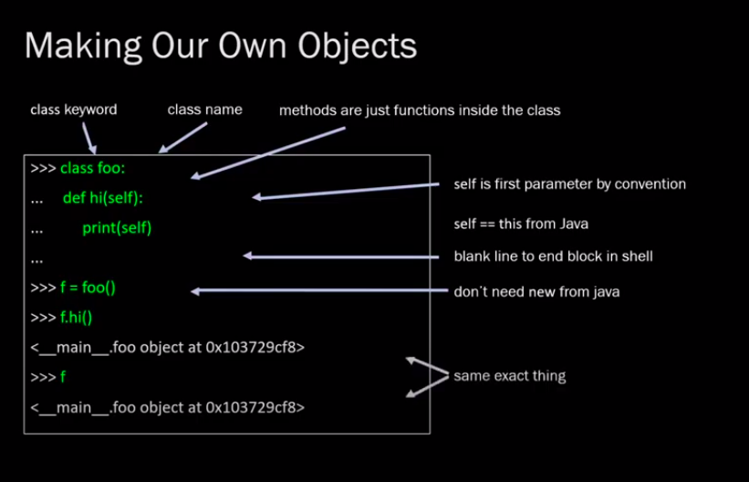

# Metaprogramming Class

- [Metaprogramming Class](#metaprogramming-class)
  - [Introduction](#introduction)
  - [Object Oriented Python](#object-oriented-python)

## Introduction

What is metaprogramming?

- Code that manipulates code
  - Reads code
  - Modifies code
  - Outputs code
- Compilers
  - Compilers Compilers... what??
- Servers
  - Server Builders
- DRY (Meta programming is very much DRY)
  - Don't Repeat Itself.
  - You should never have to copy and paste

| Lecture                | Resource |
| :--------------------- | :------- |
| Object Oriented Python | [🔗][1]   |

## Object Oriented Python

- Classes
  - Constructors
  - Fields
  - Methods
- `__init__` vs `__new__`
- Duck Typing
- Ubiquity and Homogeneity
  - `__dict__`
- Group Coding

**Make our own object**:

<!-- urls/paths -->
[1]: https://youtu.be/zcnCdHlpqrY?list=PLLet_jPomQZ-5hoX1HM-Vg_jYHGntvuw3
